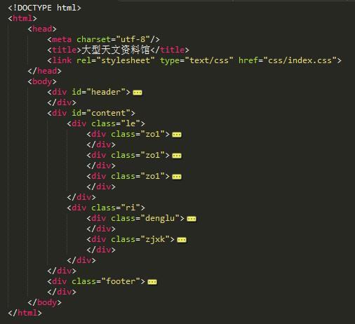

##设计文档
###【大型天文资料馆】
####设计目的
1. 熟练掌握HTML在组织结构上的优势。
2. 熟练掌握CSS在网页布局中的应用。
3. 学习Web标准及浏览器的兼容性。
####设计步骤
**1.功能性需求分析**

该网站共有3个页面，其中每一个页面的屏幕截图及主要功能如下所列。
 
（1）首页：

屏幕截图：

图一首页屏幕截图

主要实现功能：展示各个栏目最新内容列表，进入各个二级页面

首页导航栏功能：进入各个二级页面，搜索相关内容

首页登录界面功能：登录
（2）二级页面：

屏幕截图：

图二列表页屏幕截图

主要实现功能：展示文章标题，进入三级页面。

列表页侧边栏功能：转入各个子板块或转入各个同级板块。

（3）内容页

屏幕截图：

图三内容页屏幕截图

主要实现功能：展示文章内容

内容页侧边栏功能：跳转至其他列表页

内容页评论区功能：发布及查看评论，帮助天文爱好者交流

**2.搜集网站素材**

**3.建立网站代码目录结构**

**4.编写HTML代码**

（1）首页部分

（2）二级页面

（3）三级页面

**5.编写CSS布局及样式**

（1）CSS布局：

核心技术： Float实现布局：
 Position辅助布局：

（2）添加CSS样式：   
通用类属性：

	*{
	font-size: 12px;
	padding: 0;
	font-family: '宋体';
	list-style-type: none;
	text-decoration: none;
	color: white;
	}
    body{
	background-image: url(../images/bg.jpg);
	text-align: center;
	}
	a:hover{text-decoration: underline;}
背景相关类属性：

	background-image: url(../images/bg.jpg);
**6.调试浏览器兼容性**

目前未发现兼容性问题

####问题记录
1.未添加alt文字替换图片

2.< a >不能包含< li >，相反可以

3."/"  结束后不能写东西

####设计总结

1. 需求分析阶段的经验：需求分析时想过做博客，但是最后还是选择了这个，因为对宇宙我们需要多了解。
2. 编写HTML代码的经验：多熟悉，多掌握
3. CSS布局的经验：先画图画出大致板块，再布局更方便
4. 设置CSS样式经验：要多多调试大小，才能适合网页视觉
5. 调整浏览器兼容性经验： 按照主流浏览器来不断调试
6. Sublime Text使用经验：使用方便，小巧，能更快的编写程序，但是对颜色的选择有不方便的地方（不能通过颜色对比选择一个颜色）。

####课程小结
1. HTML内容：知道图片必须加上文字替换，a要在li里面，/后不能继续设置
2. CSS内容：float属性需要熟练运用。
3. 网上参考的内容：各个文章标题和一篇文章
4. 浏览器对CSS的兼容性上的不同表现（你所遇到的）：乱码

**参考文献**

1.http://www.astron.ac.cn/index.htm中国天文科普馆  
2.百度图片   
3.logo网站